**NEON COMMIT SKYLINE** — each building is one week of commits, window lights follow commit intensity. 
Hand-built SVG generator, zero dependencies, redrawn every night by [a single script](src/build.js).

