


<b>2025</b> — 13 contributions
 

<b>2024</b> — 10 contributions
 

<b>2023</b> — 10 contributions
 

<b>2022</b> — 23 contributions
 

<b>2021</b> — 17 contributions
 

<b>2020</b> — 0 contributions
 

<b>2019</b> — 1 contributions
 

<b>2018</b> — 1 contributions
 

<b>2017</b> — 5 contributions
 

<b>2016</b> — 3 contributions
 

**3D COMMIT TERRAIN** — every day as a voxel, height and color follow commit count · hand-built SVG generator, zero dependencies, redrawn nightly by [a single script](src/build.js)

